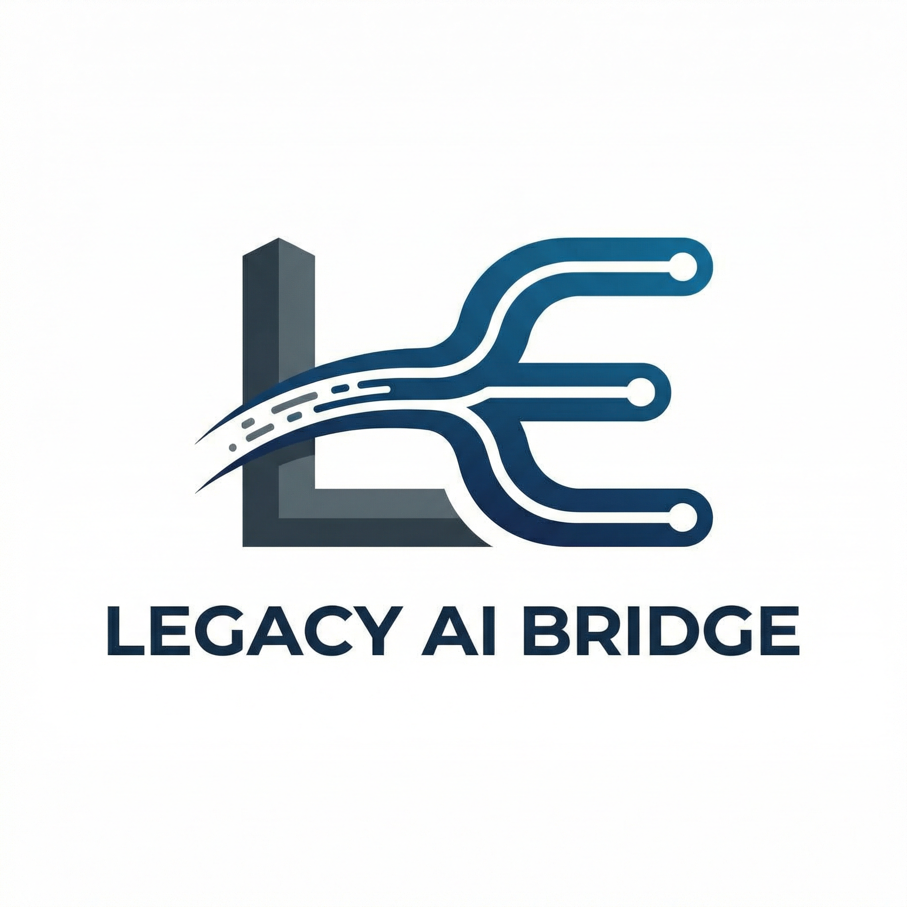
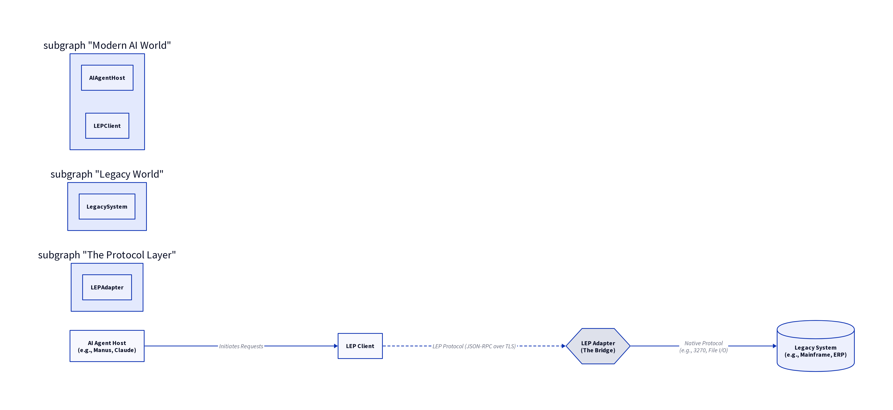

# LegacyEvolve Protocol (LEP)

**Evolve, Don't Replace: An AI-Powered Bridge to Your Legacy Systems**

  

---

## 🌟 What is the LegacyEvolve Protocol?

**LegacyEvolve Protocol (LEP)** is an open-source standard designed to bridge the gap between modern AI agents and legacy enterprise systems. Inspired by the **Model Context Protocol (MCP)**, which connects AI to modern tools, LEP provides a unified integration layer that allows AI agents to **understand, interact with, and extend** outdated systems without requiring costly and risky modernization projects.

Our philosophy is simple: **Evolve, don't just replace.**

**LEP is a Digital Public Good.** We believe that legacy modernization is a systemic challenge that requires global collaboration. By open-sourcing LEP, we're creating infrastructure that serves the public interest, accelerates innovation, and reduces the digital divide.

---

## 🎯 Project Status

**Current Phase:** Protocol Design & Validation ✅  
**Validation Status:** ✅ **APPROVED WITH MANDATORY CONDITIONS** by VerifiMind-PEAS Trinity

The LegacyEvolve Protocol has successfully completed rigorous validation using the **VerifiMind-PEAS X-Z-CS RefleXion Trinity** methodology:

*   **X-Agent (Innovation - Gemini 2.5 Flash):** Validated as **highly innovative** with a score of 9/10
*   **Z-Agent (Ethics - Manus AI):** Approved with mandatory ethical conditions for responsible deployment
*   **CS-Agent (Security - Manus AI):** Approved with mandatory security controls for enterprise-grade protection

📄 **[Read the Full Trinity Validation Report](peas/TRINITY_VALIDATION_REPORT_COMPLETE.md)**  
📄 **[Read the Open-Source Strategy Analysis](docs/OPEN_SOURCE_STRATEGY.md)**

---

## 💡 The Problem: The Legacy Dilemma

Organizations worldwide are built on a foundation of legacy technology—COBOL mainframes, aging ERPs, and custom-built systems that are critical to operations but are difficult and expensive to modernize.

*   **Prohibitive Costs:** Full modernization projects can run into the hundreds of millions of dollars.
*   **High Risk:** 2-4x budget and time overruns are common, with a high risk of failure.
*   **Talent Scarcity:** The pool of developers who understand languages like COBOL is shrinking.
*   **Innovation Gridlock:** Legacy systems prevent organizations from adopting modern AI-driven capabilities.

## The Solution: An AI-Powered Bridge

LEP provides a standardized way for AI agents to act as a **"universal translator"** for legacy systems. It enables them to:

1.  **Understand Legacy Interfaces:** Go beyond APIs to interact with green-screen terminals, file-based I/O, and proprietary protocols.
2.  **Inject Modern Skills:** Extend legacy systems with new capabilities like natural language querying, predictive analytics, and automated workflows.
3.  **Operate Safely:** Interact with critical systems within a secure, sandboxed environment with human oversight.

---

## 🏗️ Architecture: The Four Layers of LEP

LEP is designed as a multi-layered protocol that ensures secure and reliable AI-legacy interaction.

  

### Key Components

1.  **AI Agent Host:** The AI application (e.g., Manus, Claude) that initiates requests.
2.  **LEP Client:** Manages the connection to the LEP Adapter, similar to an MCP client.
3.  **LEP Adapter:** The core of the protocol. It translates AI requests into legacy system commands and vice-versa.
4.  **Legacy System:** The target system (e.g., mainframe, ERP, custom application).

📄 **[Read the Full Architecture Documentation](docs/ARCHITECTURE.md)**

---

## 🛡️ Security and Ethics: The VerifiMind-PEAS Guarantee

LEP has been validated by the **VerifiMind-PEAS X-Z-CS RefleXion Trinity**, ensuring it is innovative, ethical, and secure.

*   **X-Agent (Innovation):** Validated the paradigm shift from "replace" to "evolve" and the novel application of MCP principles to legacy systems.
*   **Z-Agent (Ethics):** Approved with mandatory conditions, including **human-in-the-loop for all write operations** and full audit logging.
*   **CS-Agent (Security):** Approved with mandatory controls, including a defense-in-depth architecture and the principle of least privilege.

### Mandatory Conditions for Deployment

The Trinity validation identified critical conditions that must be met for responsible deployment:

**Ethical Conditions:**
- Privacy and data protection framework (GDPR compliance)
- Fairness and non-discrimination safeguards
- Explicit prohibition of weapons system applications
- Transparent, immutable audit trails
- Workforce transition and reskilling programs

**Security Controls:**
- Rigorous adapter certification with independent security audits
- Mandatory input validation and sanitization in all adapters
- Zero-trust communication (mutual TLS)
- Cryptographically enforced human-in-the-loop for write operations
- Immutable audit logging to centralized SIEM

📄 **[Read the Complete Validation Report](peas/TRINITY_VALIDATION_REPORT_COMPLETE.md)**

---

## 🌍 Why Open Source? Why Public Good?

The LegacyEvolve Protocol is positioned as a **Digital Public Good (DPG)** because legacy modernization is a challenge that affects every sector and every country. No single company or government can solve it alone.

**LEP contributes to the UN Sustainable Development Goals:**

| SDG | Contribution |
|-----|--------------|
| **SDG 8: Decent Work** | Creates new roles for legacy specialists; enables modernization without mass job displacement |
| **SDG 9: Innovation & Infrastructure** | Provides critical infrastructure for AI-legacy integration |
| **SDG 12: Responsible Consumption** | "Evolve, Don't Replace" reduces e-waste from full system replacements |
| **SDG 16: Strong Institutions** | Improves government efficiency and citizen services |
| **SDG 17: Partnerships** | Creates a global ecosystem of contributors working toward shared goals |

**Open source enables:**
- **Rapid ecosystem growth** through global collaboration
- **Trust and adoption** through transparency and auditability
- **Innovation at the edges** through community contributions
- **Longevity** as permanent digital infrastructure

📄 **[Read the Full Open-Source Strategy](docs/OPEN_SOURCE_STRATEGY.md)**

---

## 🚀 Getting Started

This project is currently in the **protocol design and validation phase**. We welcome contributors, researchers, and organizations interested in shaping the future of AI-legacy integration.

### Current Priorities

1. **Protocol Specification:** Finalizing the core primitives and security controls
2. **Adapter Development Kit (ADK):** Building a secure, developer-friendly SDK (Python first)
3. **Reference Implementation:** Creating a certified adapter for a common legacy system
4. **Governance Model:** Establishing transparent, inclusive community governance
5. **Certification Program:** Designing the security and quality certification process

### Use Cases

*   **Banking:** Allow an AI agent to query customer data from a COBOL mainframe.
*   **Insurance:** Use AI to analyze claims data stored in a legacy AS/400 system.
*   **Government:** Create a modern chatbot interface for a legacy citizen services database.
*   **Manufacturing:** Inject predictive maintenance capabilities into an old SCADA system.

---

## 🤝 Contributing

LEP is an open-source project, and we welcome contributions from the community. Whether you're a developer, researcher, enterprise architect, or legacy system expert, there's a place for you in this project.

**Ways to Contribute:**

- 💻 **Code:** Develop adapters, improve the ADK, or enhance documentation
- 🔬 **Research:** Contribute to academic research on AI-legacy integration
- 🛡️ **Security:** Participate in security audits and vulnerability research
- 📚 **Documentation:** Improve guides, tutorials, and best practices
- 💬 **Community:** Help others in discussions, share use cases, and provide feedback

📄 **[Read the Contributing Guide](CONTRIBUTING.md)**

### Community Channels

- **GitHub Discussions:** [Coming Soon] For questions, ideas, and community discussions
- **GitHub Issues:** For bug reports and feature requests
- **X (Twitter):** [@creator35lwb](https://x.com/creator35lwb) for project updates
- **Email:** creator35lwb@gmail.com for inquiries

---

## 📚 Documentation

- **[Architecture Documentation](docs/ARCHITECTURE.md)** - Technical specification and design
- **[Trinity Validation Report](peas/TRINITY_VALIDATION_REPORT_COMPLETE.md)** - Full VerifiMind-PEAS validation
- **[Open-Source Strategy](docs/OPEN_SOURCE_STRATEGY.md)** - Strategic analysis and governance model
- **[Academic References](research/ACADEMIC_REFERENCES.md)** - Research papers and citations
- **[Contributing Guide](CONTRIBUTING.md)** - How to get involved

---

## 🗺️ Roadmap

### Phase 1: Foundation (Months 1-6) - **Current Phase**
- ✅ Protocol specification v1.0 (In Progress)
- ✅ VerifiMind-PEAS Trinity validation (Complete)
- ⏳ Secure ADK (Python) v0.1
- ⏳ Governance charter and community guidelines
- ⏳ Project website and GitHub Discussions

### Phase 2: Reference Implementation (Months 7-12)
- Reference adapter for mainframe systems
- Certification process MVP
- AI agent host integration (LangChain, Manus)
- First pilot projects with early adopters

### Phase 3: Ecosystem Growth (Months 13-24)
- Bug bounty program launch
- Expanded ADKs (Java, Go)
- Industry partnerships and enterprise pilots
- Workforce transition and training programs

---

## 📜 License

LegacyEvolve Protocol is licensed under the **MIT License**. See [LICENSE](LICENSE) for details.

---

## 🙏 Acknowledgments

This project is validated by the **[VerifiMind-PEAS](https://github.com/creator35lwb-web/VerifiMind-PEAS)** methodology, which ensures that AI systems are innovative, ethical, and secure.

Special thanks to:
- The **Model Context Protocol (MCP)** community for inspiring this work
- All contributors and early adopters who believe in the "Evolve, Don't Replace" philosophy
- The global community of legacy system experts who keep critical infrastructure running

---

## 📞 Contact

**Project Lead:** creator35lwb  
**Email:** creator35lwb@gmail.com  
**X (Twitter):** [@creator35lwb](https://x.com/creator35lwb)  
**GitHub:** [creator35lwb-web](https://github.com/creator35lwb-web)

---

  <strong>Built with ❤️ for the public good</strong> 
  <em>Evolve, Don't Replace</em>

